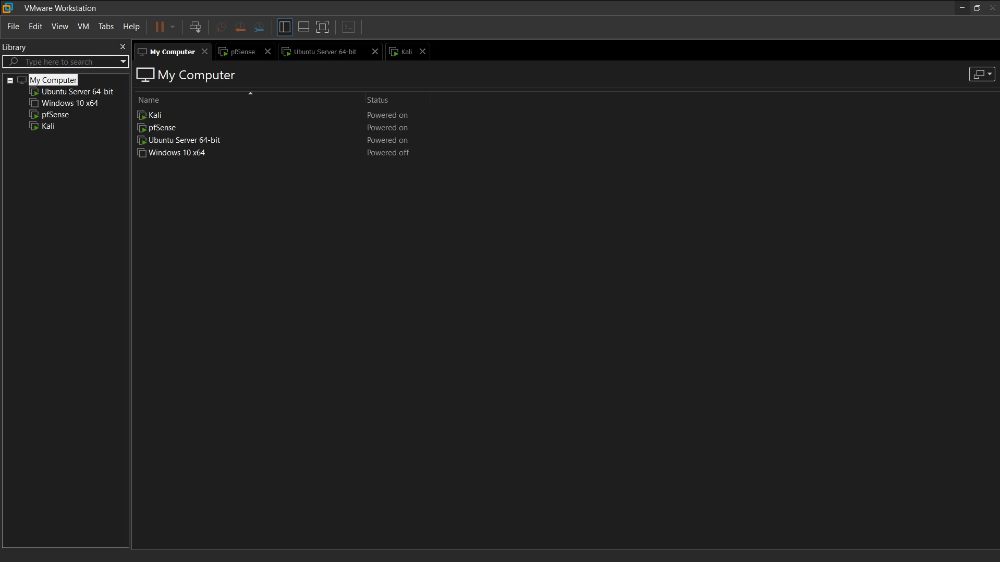
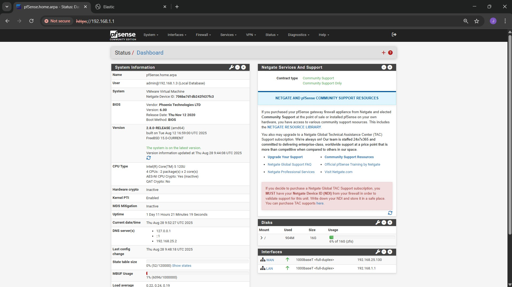
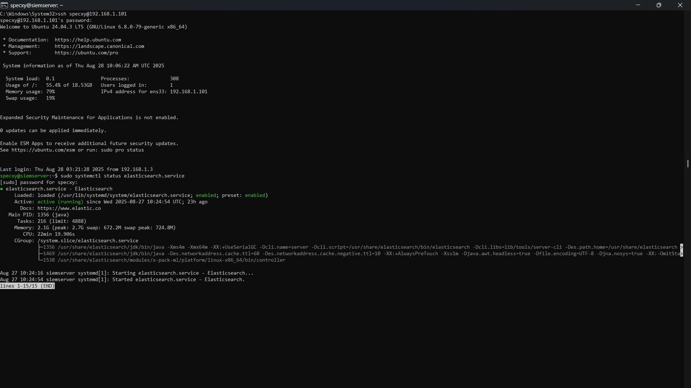
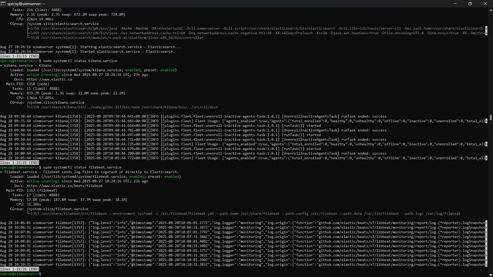
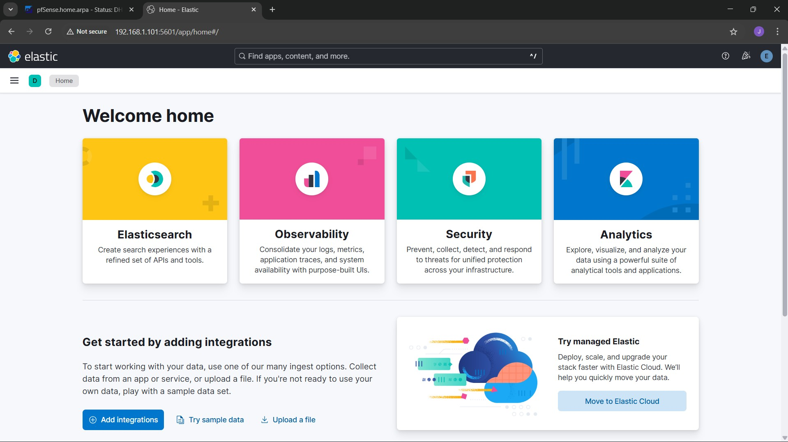
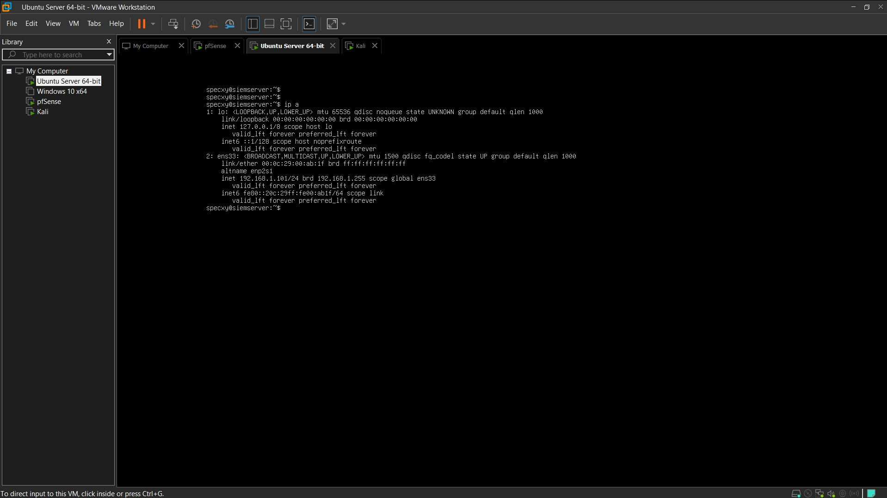

# SIEM-SOAR-Lab

A home lab implementation of SIEM/SOAR for log collection and incident response using Elastic Stack, Wazuh Integration, TheHive SOAR Setup, and simulated attacks/analyses.

## Project Overview
- **Objective**: Build a SIEM/SOAR lab to collect, analyze, and respond to logs, showcasing defensive cybersecurity skills.
- **Duration**: July 2025 – September 2025 (12 weeks).
- **Tools/Environment**: VMware Workstation (host on Windows 11 laptop), pfSense firewall, Ubuntu 24.04 LTS server (Elastic Stack), Windows 10 endpoint (Sysmon), Kali Linux attacker. Internet via mobile hotspot (routing through 192.168.25.x subnet).
- **Repo Structure**:
  - `docs/`: Detailed weekly write-ups.
  - `screenshots/`: Visuals of setups and interfaces.
  - `configs/`: Configuration file snippets.
  - `logs/`: Command and SSH logs.
- **Progress**: Week 1-2 completed (Lab Design and VM Setup). Upcoming: Weeks 3-4 (Wazuh Integration).

## Week 1-2: Lab Design and VM Setup
### Actual vs. Planned Setup
| Aspect | Planned (Original Project) | Actual Implementation |
|--------|----------------------------|-----------------------|
| Hypervisor | VirtualBox | VMware Workstation (as shown in screenshots/vmware-vms-overview.png) – Chosen for better performance on host hardware (16GB RAM Intel processor). |
| Network Topology | pfSense (WAN bridged to WiFi, LAN internal), Ubuntu/Windows/Kali on internal net. | Same, but using VMware's Bridged (for WAN to mobile hotspot) and VMnet (custom internal for LAN). pfSense gateway: 192.168.1.1. Ubuntu IP: 192.168.1.101 (ens33 interface). Internet routing: Traceroute shows mobile hotspot at 192.168.25.2. |
| VMs | pfSense, Ubuntu Server, Windows 10, Kali. | Created in VMware: Kali (powered on), pfSense (powered on), Ubuntu Server 64-bit (powered on, hostname: siemserver, user: specxy), Windows 10 x64 (powered off during log capture). Allocated RAM: ~4GB Ubuntu, 2GB others. |

### Detailed Steps and Commands
Accessed Ubuntu VM via SSH from host: `ssh specxy@192.168.1.101` (note: Log shows initial connect to .102 – possibly a prior DHCP lease; updated to .101).

1. **VM Creation and Networking in VMware**:
   - Installed VMware Workstation (free Player version sufficient for lab).
   - Created VMs: File > New Virtual Machine > Used ISOs for pfSense, Ubuntu 24.04.3 LTS, Windows 10; imported Kali .ova.
   - Network: pfSense with 2 adapters (Bridged to WiFi for WAN, Custom VMnet for LAN). Other VMs on Custom VMnet (DHCP via pfSense: 192.168.1.100-200 range).
   - Test: Ping 8.8.8.8 from VMs (routes through pfSense > mobile hotspot).

2. **pfSense Installation and Firewall Config**:
   - Installed pfSense CE (latest AMD64 ISO).
   - Web GUI: https://192.168.1.1 (admin/pfsense).
   - Rules: WAN outbound allow all (with logging); LAN allow HTTP/HTTPS to Elastic ports (9200, 5601).

3. **Ubuntu Setup with Elastic Stack**:
   - Installed Ubuntu Server, enabled OpenSSH.
   - Updated system and installed Java:

sudo apt update && sudo apt upgrade -y
sudo apt install default-jdk

- Added Elastic repo and installed components (Elasticsearch already present in log):

wget -qO - https://artifacts.elastic.co/GPG-KEY-elasticsearch | sudo gpg --dearmor -o /usr/share/keyrings/elasticsearch-keyring.gpg
echo "deb [signed-by=/usr/share/keyrings/elasticsearch-keyring.gpg] https://artifacts.elastic.co/packages/8.x/apt stable main" | sudo tee /etc/apt/sources.list.d/elastic-8.x.list
sudo apt update
sudo apt install elasticsearch kibana filebeat -y

- Edited `/etc/elasticsearch/elasticsearch.yml` (via `sudo nano`):

network.host: 0.0.0.0
discovery.type: single-node

- Started services:

sudo systemctl enable elasticsearch && sudo systemctl start elasticsearch
sudo systemctl enable kibana && sudo systemctl start kibana
sudo systemctl enable filebeat && sudo systemctl start filebeat

- Set passwords (auto mode; log truncated – redacted sensitive output):

sudo /usr/share/elasticsearch/bin/elasticsearch-setup-passwords auto

- Verification: `curl -X GET "http://localhost:9200"` (initially failed due to config; resolved after edits). Status checks show services running (e.g., Elasticsearch active since Aug 27, 2025).
- Filebeat config: Edited `/etc/filebeat/filebeat.yml` for system modules and Elasticsearch output.

  

4. **Windows 10 with Sysmon**:
- Installed Windows 10 x64.
- Downloaded Sysmon.zip, installed via CMD: `sysmon64 -accepteula -i`.
- Logs in Event Viewer > Microsoft > Windows > Sysmon.

5. **Kali Setup**:
- Imported .ova, updated: `sudo apt update && sudo apt upgrade -y`.

### Troubleshooting and Notes
- SSH fingerprint warning resolved with 'yes'.
- Curl to Elasticsearch initially empty (fixed by config edits and restart).
- Internet connectivity: VMs route through pfSense to mobile hotspot; traceroute timeouts beyond hotspot normal for mobile networks.
- Full SSH log: See [logs/week1-2-ssh-logs.txt](logs/week1-2-ssh-CommandLogs.txt) for raw commands (truncated sections summarized here).
- Resources Used: Elastic.co docs, VMware tutorials (instead of VirtualBox).

## Upcoming Sections
- Week 3-4: Wazuh Integration (install on Ubuntu, agents on Windows/Kali).
- ...

## License
MIT License (see LICENSE file).

